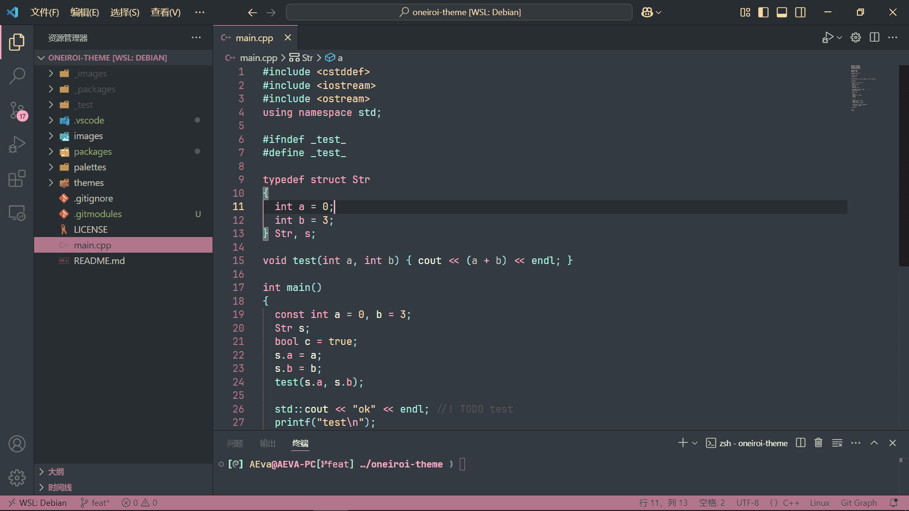
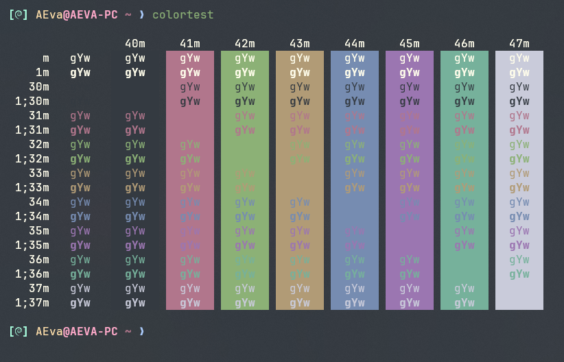
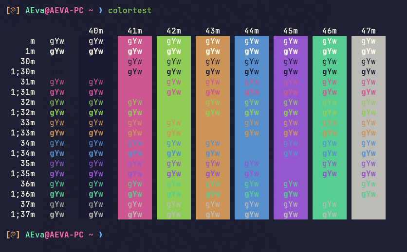

# Oneiroi theme

> Fantasy world,fantasy code

  

  

> A fantastic theme for :  

- [Visual Studio Code](http://github.com/OneiroiTheme/vscode)
- [Neovim](http://github.com/OneiroiTheme/oneiroi.nvim)
- [Alacritty](http://github.com/OneiroiTheme/alacritty)
- [Windows Terminal](http://github.com/OneiroiTheme/windows-terminal)
- [Wezterm](http://github.com/OneiroiTheme/wezterm)
- [Termux](http://github.com/OneiroiTheme/termux)
- [Oh My Posh](http://github.com/OneiroiTheme/oh-my-posh)
- [Starship](http://github.com/OneiroiTheme/starship)
- [Tmux](http://github.com/OneiroiTheme/tmux)
- and [more](./themes/)

## color palattes

1. [oneiroi dream](./palettes/dream.css)

    

2. [oneiroi melatonin](./palettes/melatonin.css)

    

## License

[MIT LICENSE](./LICENSE)
