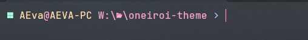

# Oneiroi for [Oh My Posh](https://ohmyposh.dev/)

  

✨A beautiful theme for `Oh My Posh`.  

  

## Installation

To install [Oh My Posh](https://ohmyposh.dev) on MacOS/Windows/Linux follow documentation [here](https://ohmyposh.dev/docs/installation/windows).

### Activating Theme

For instructions on activating this theme in `powershell`, `cmd`, `xsh`, `bash`, `fish` and `nu` please refer to the documentation [here](https://ohmyposh.dev/docs/installation/customize).

### Fonts

Nerd Fonts are required for the Oneiroi theme. To display all icons, the use of [Nerd Fonts](https://www.nerdfonts.com/) is recommended. More information on fonts can be found [here](https://ohmyposh.dev/docs/installation/fonts).
