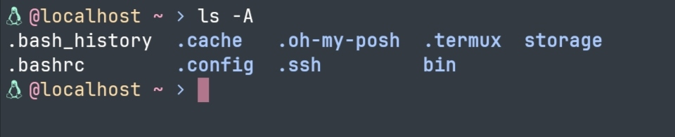

# Oneiroi for [Termux](https://termux.dev/)

  

✨A beautiful theme for `Termux`.  

  

## Installation

1. Open Termux and go to the `.termux` directory by `cd .termux`, if it doesn't exist, please create the directory by `mkdir .termux`.
2. Open [oneiroi-theme.properties](oneiroi-theme.properties) and save it as `colors.properties` in your `.termux` directory .
3. Restart Termux with `exec zsh` or exit the sessions and open again.
