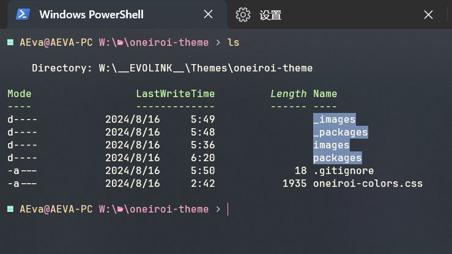

# Oneiroi for [Windows Terminal](https://github.com/microsoft/terminal)

<p align="center">
  
</p>

✨A beautiful theme for `Windows Terminal`.  

<p align="center">
  
</p>

## Installation

1. Start Windows Terminal.
2. Click on the down arrow icon and select the `Settings` option.
3. On the left menu, select `Open JSON file`
4. Pick one of the themes from the list and note the name of the theme:
   - [oneiroi-theme.json](oneiroi-theme.json)
5. In the `settings.json` file, find the section called "Schemes" and paste your chosen theme inside of schemes array `[ ]`.
6. Yet in the `settings.json`file, find the profiles section and set a "colorScheme" value on the `default profile` and write the name you noted, as the following example (if you chose "Aura Dark"):

     ```json
     "profiles": {
         "defaults": {
             "colorScheme": "Oneiroi Dark"
         }
     }
     ```
